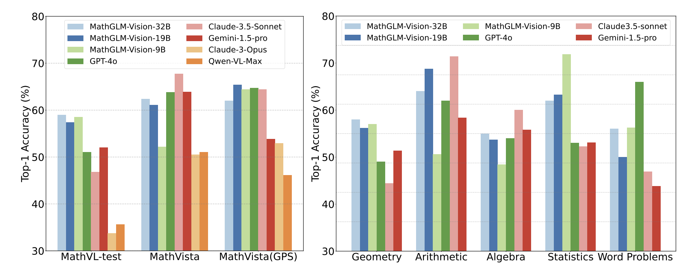

# MathGLM-Vision
Official Pytorch Implementation for MathGLM-Vision




We have developed a new series of multimodal mathematical models, MathGLM-Vision, and open-sourced two models based on GLM-4V-9B and CogVLM2, respectively. Compared to backbone models and open-source mathematical MLLMs (Multi-modal Large Language Models), MathGLM-Vision achieves significant improvements on several public benchmarks and our curated MathVL-test. 


If you want to find the detailed introduction, Read our paper: [MathGLM-Vision: Solving Mathematical Problems with Multi-Modal Large Language Model](https://arxiv.org/pdf/2409.13729).

## Model checkpoint
The checkpoints for MathGLM-Vision-9B and MathGLM-Vision-19B, based on GLM-4V-9B and CogVLM2 respectively, are now available.

- [MathGLM-Vision-9B checkpoint](https://huggingface.co/THUDM/MathGLM-Vision)
- [MathGLM-Vision-19B checkpoint](https://huggingface.co/THUDM/MathGLM-Vision-19B)


## Benchmark 

Our MathGLM-Vision models have achieved strong performance across various benchmarks, including MathVista, MathVerse, and MathVision. Additionally, we introduce a benchmark called MathVL-test, designed to evaluate the ability of Multi-Modal Large Language Models (MLLMs) in multimodal mathematical reasoning, specifically within the context of Chinese K12 education.

| Model               | MathVista (GPS) | MathVista | MathVerse | MathVision | MathVL-test|
|:--------------------|:----------:|:--------:|:------:|:----:|:----:|
| MathGLM-Vision-9B   |    64.42   |   52.20  |  44.20 | 19.18| 57.05 |
| MathGLM-Vision-19B  |    65.38   |   61.10  |  42.50 | 21.64| 57.30 |
| MathGLM-Vision-32B  |    62.02   |   62.40  |  49.20 | 26.51| 59.00 |


## Detailed performance
Performance comparison between MathGLM-Vision and Closed Source MLLMs.

| Model               | MathVista (GPS) | MathVista | MathVerse | MathVision | MathVL-test|
|:--------------------|:----------:|:--------:|:------:|:----:|:----:|
| Gemini Pro   |    40.40  |   45.20  |  36.80 | 17.66| - |
| Gemini-1.5-Pro   |   53.85   |  63.90  |  51.08 | 19.24| 52.03 |
| GPT-4V   |    50.50  |   49.90  |  50.80 | 22.76| 35.89 |
| GPT-4-turbo   |    58.25   |   58.10  |  43.50 | 30.26 |  42.19 |
| GPT-4o   |    64.71   |   63.80  |  56.65 | 30.39| 51.05 |
| Claude3-Opus   |    52.91   |   50.50  |  31.77 | 27.13| 33.77 |
| Claude3.5-Sonnet    |    64.42   |   67.70  |  48.98 | 37.99| 46.84 |
| Qwen-VL-Plus   |33.01   |  43.30  |  19.10 | 10.72 | 28.50 |
| Qwen-VL-Max   |    46.12   |   51.00  |  35.90 | 15.59| 35.61 |
| MathGLM-Vision-9B   |    64.42   |   52.20  |  44.20 | 19.18| 57.05 |
| MathGLM-Vision-19B  |    65.38   |   61.10  |  42.50 | 21.64| 57.30 |
| MathGLM-Vision-32B  |    62.02   |   62.40  |  49.20 | 26.51| 59.00 |

Performance comparison between MathGLM-Vision and Open Source mathematical MLLMs.

| Model               | MathVista (GPS) | MathVista | MathVerse | MathVision | 
|:--------------------|:----------:|:--------:|:------:|:----:|
| G-LLaVA (13B)  | 56.70   |  35.84  |  14.59 | 13.27 |
| LLaVA-1.5-G (13B)   |    36.54   |   48.34 |  15.61 | 14.88 |
| ShareGPT4V-G (13B)   | 43.27   |  49.14  |  16.37 | 14.45 |
| Math-LLaVA   |    57.70   |   46.60  |  19.04 | 15.69|
| MathGLM-Vision-9B   |    64.42   |   52.20  |  44.20 | 19.18| 57.05 |
| MathGLM-Vision-19B  |    65.38   |   61.10  |  42.50 | 21.64| 57.30 |
| MathGLM-Vision-32B  |    62.02   |   62.40  |  49.20 | 26.51| 59.00 |


## Quick start

### Inference

### Finetune


## Citation

If you find our work helpful, please consider citing the following papers

```
@article{yang2024mathglm,
  title={MathGLM-Vision: Solving Mathematical Problems with Multi-Modal Large Language Model},
  author={Yang, Zhen and Chen, Jinhao and Du, Zhengxiao and Yu, Wenmeng and Wang, Weihan and Hong, Wenyi and Jiang, Zhihuan and Xu, Bin and Dong, Yuxiao and Tang, Jie},
  journal={arXiv preprint arXiv:2409.13729},
  year={2024}
}
```
